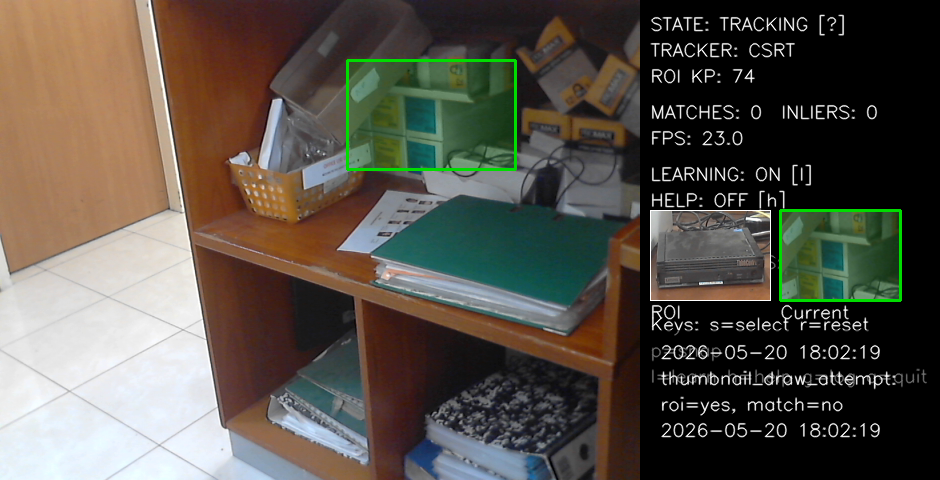
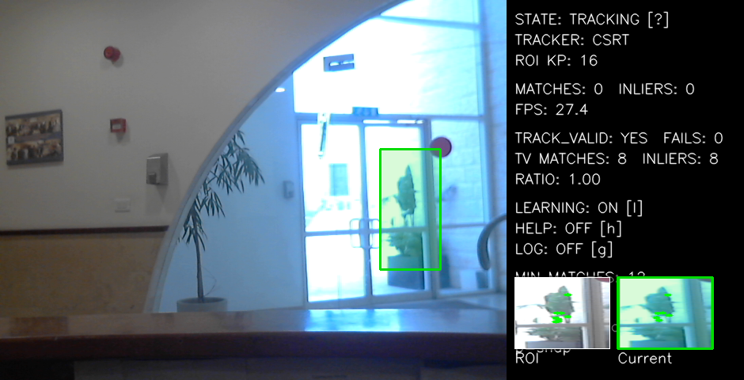
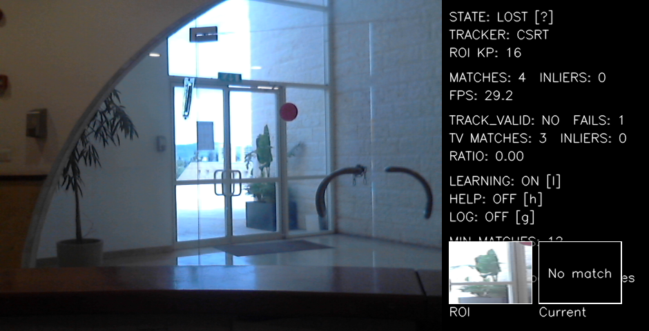
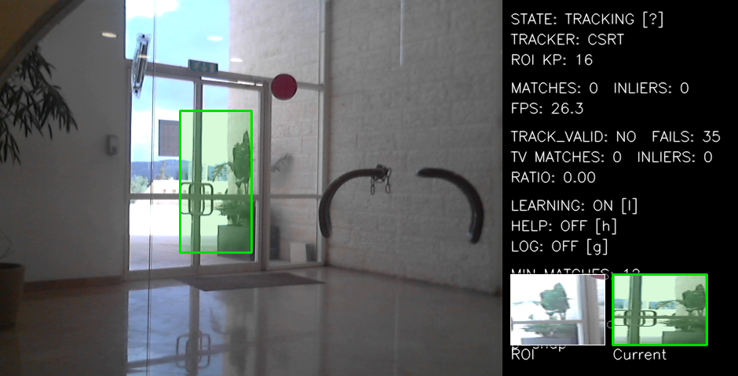
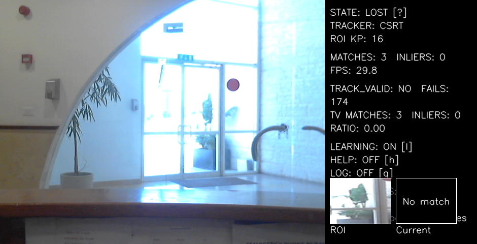

# ROI Tracker Demo

A compact Windows-friendly Python/OpenCV desktop demo for selecting a region in a live webcam feed, tracking it frame-to-frame, and attempting feature-based re-detection after tracking is lost.

## Purpose

I built this project as a hands-on computer vision exercise to understand how an ROI-based tracking pipeline works in practice: webcam capture, manual ROI initialization, tracker state management, failure handling, ORB feature matching, and basic re-detection.

The focus is on a small, inspectable implementation with clear runtime feedback and known limitations, rather than a production-grade tracker.

## What it does

- Opens a live webcam stream.
- Lets you manually select an ROI with OpenCV's built-in selector.
- Tracks the selected region in real time.
- Switches to `LOST` when tracking fails.
- Tries to re-detect the original ROI using ORB feature matching.
- Rebuilds the tracker when a good re-detection is found.

## Demo Screenshots
These screenshots were captured during development tests and may not all be from the same continuous run.







Short captions:
- ROI selection – The user manually selects a Region of Interest (ROI).
- Validated tracking – The ROI is tracked while still visible, with debug validation metrics.
- Lost / no-match state – The ROI is no longer confidently visible, so the app switches to a lost/searching state.
- Re-acquisition after return – The tracker can re-acquire the region after returning toward the target area.
- Unstable re-detection / limitation – Re-detection is not always stable, and the ROI can be lost again.

## Requirements

- Windows 11
- Python 3.10 or newer
- A working webcam
- VS Code with Python support

## Setup on Windows 11

Open PowerShell in the project folder and run:

```powershell
python -m venv .venv
.venv\Scripts\Activate.ps1
pip install -r requirements.txt
```

If PowerShell blocks script execution, run this once in the same shell:

```powershell
Set-ExecutionPolicy -Scope Process RemoteSigned
```

## Run

```powershell
python main.py
```

## Run tests (no webcam required)

```powershell
python -m unittest discover -s tests -p "test_*.py"
```

If the webcam does not open, try changing `CAMERA_INDEX` in [config.py](config.py) from `0` to `1`, or to `2` if needed.

## Controls

- `s` = select ROI
- `r` = reset
- `p` = save screenshot
- `l` = toggle Learning Mode
- `h` = toggle help panel
- `g` = toggle event log
- `q` = quit

## Status labels

- `NO_TARGET`
- `TRACKING`
- `LOST`
- `RE-DETECTED`

## Manual test plan

1. Start the app.
2. Press `s`.
3. Select a textured ROI such as a logo, printed text, or patterned object.
4. Move the camera slightly and confirm the box keeps tracking.
5. Move the target out of view and confirm the status changes to `LOST`.
6. Move the camera back toward the original view and confirm re-detection can recover the box.
7. Try a hard case with a large scale or viewpoint change and confirm failure is acceptable.

## Notes and limitations

- Re-detection is based on visual similarity in the current frame only.
- Large viewpoint, scale, blur, or lighting changes may prevent recovery.
- The demo works best with textured ROIs that have many visual features.
- This is a practical MVP, not a production tracker.


